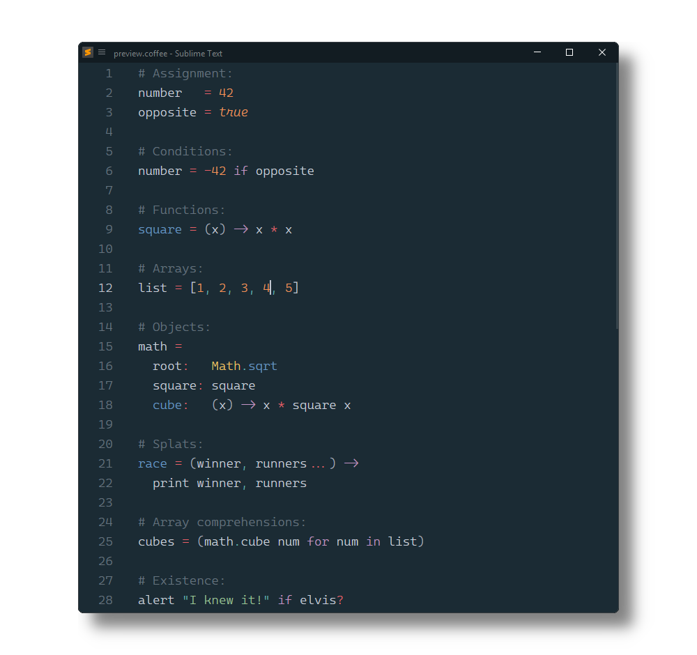

# CoffeeScript 

[CoffeeScript](https://coffeescript.org/) syntax definitions build system and snippets for [Sublime Text](https://www.sublimetext.com).



**This package is for Sublime Text 3+**.
An old version for Sublime Text 2 is accessible via the [`st2` branch](https://github.com/SublimeText/BetterCoffeeScript/tree/st2).

# Installation

### Package Control

The easiest way to install is using [Package Control](https://packagecontrol.io). It's listed as `CoffeeScript`.

1. Open `Command Palette` using <kbd>ctrl+shift+P</kbd> or menu item `Tools → Command Palette...`
2. Choose `Package Control: Install Package`
3. Find `CoffeeScript` and hit <kbd>Enter</kbd>

## Source Control

> [!TIP]
>
> Only recommended, if contributions to this package are planned.

Sublime stores packages in the following locations:

```sh
Nix: ~/.config/sublime-text/packages
Mac: ~/Library/Application\ Support/Sublime\ Text/Packages
Win: %APPDATA%\Sublime Text\Packages
```

### As a repository within the packages directory

Open a Terminal/Console and run the following commands, replacing `PACKAGE_PATH` with the path corresponding to your OS above.

```sh
cd PACKAGE_PATH
git clone https://github.com/SublimeText/BetterCoffeeScript.git "CoffeeScript"
```

### As a repository outside of the packages directory

If you use Github for Mac/Windows which store repositories in a specific location, or if you just don't want a repository in your packages directory, then instead you can use a link.

1. Clone the repository via GUI program or command line:
   
   ```sh
   cd WHEREVER_YOU_WANT
   git clone https://github.com/SublimeText/BetterCoffeeScript.git
   ```

2. Once that is done, create the link:

   **Windows:**
   
   ```sh
   cd PACKAGE_PATH
   mklink /D "CoffeeScript" ABSOLUTE_PATH_TO_REPOSITORY
   ```
   
   **Nix/Mac:**
   
   ```sh
   cd PACKAGE_PATH
   ln -s ABSOLUTE_PATH_TO_REPOSITORY "CoffeeScript"
   ```

# Commands/Shortcuts

You can access the commands either using the command palette (`ctrl+shift+P` or `cmd+shift+P`) or via shortcuts.

  alt+shift+t - Run a Cake task
  alt+shift+r - Run some CoffeeScript (prints output to a panel on the bottom)
  alt+shift+s - Run a syntax check
  alt+shift+c - Compile a file
  alt+shift+d - Display compiled JavaScript
  alt+shift+l - Display lexer tokens
  alt+shift+n - Display parser nodes
  alt+shift+w - Toggle watch mode
  alt+shift+p - Toggle output panel


Context menu has `Compile Output` that compiles the current CoffeeScript and outputs the javascript code that is run, in a panel.

**Note:** Some of the commands use the Status Bar for output, so you'll probably want to enable it (View » Show Status Bar).

# Snippets

- Use `TAB` to run a snippet after typing the trigger.
- Use `TAB` and `shift+TAB` to cycle forward/backward through fields.
- Use `ESC` to exit snippet mode.

### Snippet Triggers

**Comprehension**

  Array:  forin
  Object: forof
  Range:  fori (inclusive)
  Range:  forx (exclusive)

**Statements**

  If:        if
  Else:      el
  If Else:   ifel
  Else If:   elif
  Switch:    swi
  Ternary:   ter
  Try Catch: try
  Unless:    unl

**Classes**

  Class - cla
  Class extends SuperClass - clx

**Other**

  Function:      -
  Function:      = (bound)
  Interpolation: #

# Building

> When using the build system, it is assumed that your `.sublime-project` file lives in your project's base directory (due to limitations with the build system).

Hitting `F7` (Tools » Build) will run the Cake task 'sbuild'.

If you're not quite sure what the point of this is then read on.

Let's say before distributing your project that you would like to combine all of your `.js` files into one and then minify them them using UglifyJS or something.

That's what this is for! You would create a `Cakefile` and inside it you would write a task:

  task 'sbuild', 'Prepare project for distribution.', ->
    # ...

# Settings

Go to `Preferences > Package Settings > CoffeeScript > Settings - User` to change settings.

```jsonc
{
  /*
    The directories you would like to include in $PATH environment variable.
    Use this if your node installation is at a separate location and getting errors such as `cannot find node executable`

    example:
    "envPATH": "/usr/local/sbin:/usr/local/bin:/usr/sbin:/usr/bin:/sbin:/bin"

  */
  "envPATH": "/usr/local/sbin:/usr/local/bin:/usr/sbin:/usr/bin:/sbin:/bin",
  /*
    The directory containing your coffee binary. Usually
    /usr/local/bin.
  */
  "binDir": "/usr/local/bin",

  /*
    Compile without the top-level function wrapper (coffee -b).
  */

  "noWrapper": true,

  /*
    Enable or disable refresh the compiled Output on Save.
    Only available for watch mode.
  */
  "watchOnSave": true,
  /*
    Enable refreshing compiled JS when CoffeeScript is modified.

    Put false to disable
    Put a number of seconds to delay the refresh
  */
  "watchOnModified": 0.5,
  /*
    Enable Compiling on save. It will compile into the same folder.
  */
  "compileOnSave": true,
  /*
    ## Enable outputting the results of the compiled coffeescript in a panel
  */
  "showOutputOnSave": false,
  /*
    ## Enable compiling to a specific directory.
    #### Description

    if it is a string like 'some/directory' then `-o some/directory` will be added to `coffee` compiler.
    if it is false or not string then it will compile your `script.coffee` to the directory it is in.

    #### Example:
    Directory is relative to the file you are editing if specified such as
      compileDir": "out"
    Directory is absolute if specified such as
      compileDir": "/home/logan/Desktop/out"

  */
  "compileDir": false,
  /*
    ## Enable compiling to a specific relative directories.

    #### Example:
    Set absolute path for compile dir:
      "compileDir": "/home/user/projects/js"
    And specified folders
      "relativeDir": "/home/user/projects/coffee"
      "compilePaths":
      {
        "/home/user/projects/coffee": "/home/user/projects/first/js",
        "/home/user/projects/second/coffee": "../js",
      }

    So
      "/home/user/projects/coffee/app.coffee" will compile to "/home/user/projects/first/js/app.js"
      "/home/user/projects/coffee/models/prod.coffee" will compile to "/home/user/projects/first/js/models/prod.js"
      "/home/user/projects/coffee/second/coffee/app2.coffee" will compile to "/home/user/projects/second/js/app2.js"
      "/home/user/projects/main.coffee" will compile to "/home/user/projects/js/main.js"

  */
  "compilePaths": false,
}
```

## Project settings

Go to `Project > Edit Project` to change project settings.

```json
{
  "folders": [
    "."
  ],
  "settings": {
    "CoffeeScript": {
      "noWrapper": true,
      "compileOnSave": true,
      "compileDir": "out"
    }
  }
}
```

# FAQ

Most of the linux terminal commands written here can be run via [cygwin](http://cygwin.com/install.html) - aka Linux Terminal in Windows.

- Most of the problems are related to configurations. Remember to configure `binDir` after you install!


- Do I have coffee-script installed?

Try finding coffee-script in your global npm list with `npm ls -g | grep coffee` which will output something like:

```bash
npm ls -g | grep coffee

# will output:
#├── coffee-script@1.6.3
#├─┬ coffeelint@0.5.6
#│ ├── coffee-script@1.6.3
#├── UNMET DEPENDENCY generator-coffee *
#│ │ ├── coffee-script@1.3.3
```


- Where can I find out the path to coffee binary?

In Linux `which` command will tell you where a command originates from. In terminal type:

```bash
which coffee
# /usr/bin/coffee
```

This path will go into the `binDir` setting.

- I'm getting the error message `'coffee' is not recognized as an internal or external command,` when saving.

The coffee-script binary probably is not installed. Either install coffee-script or set `checkSyntaxOnSave` and `compileOnSave` to `false` in `Preferences > Package Settings > CoffeeScript > Settings - User`.
